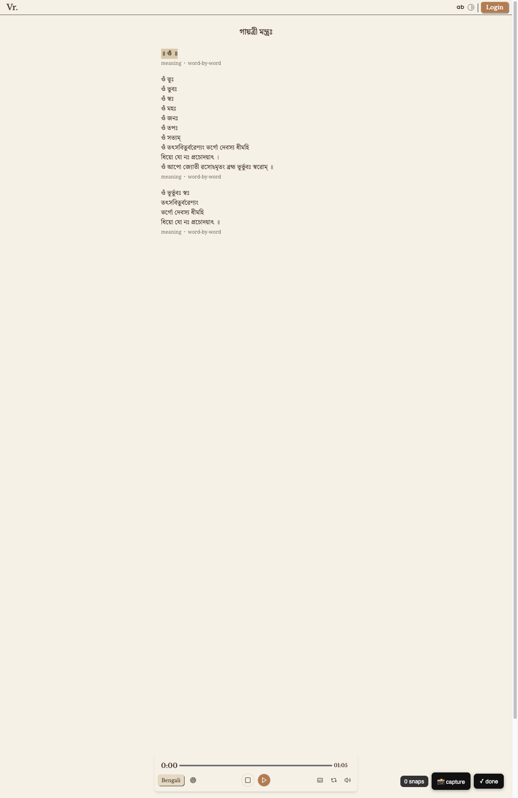

# CDP — network sniffing and replay


<!-- WARNING: THIS FILE WAS AUTOGENERATED! DO NOT EDIT! -->

The cdp module wraps Chrome’s DevTools Protocol behind a synchronous
interface. `automation_browser()` is the single entry point — it
launches Chrome with a persistent debug profile so cookies and sessions
survive across runs. For SSO or enterprise sites, log in once in the
browser window; every subsequent call picks up that session
automatically.

Use cdp when scrapling’s stealth mode is not enough: the site checks for
enterprise SSO, reads cookies from a previous session, or ties requests
to a specific browser fingerprint.

------------------------------------------------------------------------

<a
href="https://github.com/vedicreader/fossick/blob/main/fossick/cdp.py#L103"
target="_blank" style="float:right; font-size:smaller">source</a>

### setup_chrome_daemon

``` python

def setup_chrome_daemon(
    port:int=9222, chrome_path:NoneType=None, profile_dir:NoneType=None, uninstall:bool=False
)->bool:

```

*Install (or uninstall) a system service that starts Chrome with remote
debugging at login*

------------------------------------------------------------------------

<a
href="https://github.com/vedicreader/fossick/blob/main/fossick/cdp.py#L48"
target="_blank" style="float:right; font-size:smaller">source</a>

### chrome_info

``` python

def chrome_info(
    port:int=9222, chrome_path:NoneType=None, profile_dir:NoneType=None
):

```

*Return a dict of info needed to launch Chrome with CDP on macOS*

------------------------------------------------------------------------

<a
href="https://github.com/vedicreader/fossick/blob/main/fossick/cdp.py#L46"
target="_blank" style="float:right; font-size:smaller">source</a>

### launchctl

``` python

def launchctl(
    label
):

```

*Call self as a function.*

------------------------------------------------------------------------

<a
href="https://github.com/vedicreader/fossick/blob/main/fossick/cdp.py#L111"
target="_blank" style="float:right; font-size:smaller">source</a>

### ws_url

``` python

def ws_url(
    p:int=9222
):

```

*Call self as a function.*

``` python
ws_url()
```

    'ws://127.0.0.1:9222/devtools/browser/89b370cc-05f6-486f-a92b-db8f45520df2'

------------------------------------------------------------------------

<a
href="https://github.com/vedicreader/fossick/blob/main/fossick/cdp.py#L120"
target="_blank" style="float:right; font-size:smaller">source</a>

### cdp_connect

``` python

async def cdp_connect(
    port:int=9222
):

```

*Connect to Chrome DevTools Protocol on the given port. Tries localhost
and 127.0.0.1*

------------------------------------------------------------------------

<a
href="https://github.com/vedicreader/fossick/blob/main/fossick/cdp.py#L136"
target="_blank" style="float:right; font-size:smaller">source</a>

### syncy

``` python

def syncy(
    coro, tout:int=60
):

```

*Call self as a function.*

------------------------------------------------------------------------

<a
href="https://github.com/vedicreader/fossick/blob/main/fossick/cdp.py#L140"
target="_blank" style="float:right; font-size:smaller">source</a>

### CDP.open_page

``` python

async def open_page(
    url
):

```

*Call self as a function.*

``` python
cdp = syncy(cdp_connect())
```

``` python
pgs = syncy(cdp.pages)
if pgs:
    tid = pgs[0]['targetId']
    sid = syncy(cdp.attach(tid))
    pg=Page(cdp, tid, sid)
    root = syncy(pg.ax_tree())
    print(str(root)[:300])
```

``` python
page = syncy(cdp.new_page())
syncy(page.goto('https://vedicreader.com/s/'))
rt = syncy(page.ax_tree())
print(str(rt)[:300])
```

    - **RootWebArea** "vedicreader" `focusable=True` `url=https://vedicreader.com/` [#2]
      - **navigation** "" [#183]
        - **link** "Vr." `focusable=True` `url=https://vedicreader.com/` [#184]
          - **heading** "Vr." `level=4` [#185]
            - **StaticText** "Vr." [#262]
              - **InlineTextBox**

``` python
syncy(page.click(rt.find_id('button', 'Test Drive')))
```

------------------------------------------------------------------------

<a
href="https://github.com/vedicreader/fossick/blob/main/fossick/cdp.py#L147"
target="_blank" style="float:right; font-size:smaller">source</a>

### CDP.calls

``` python

async def calls(
    url:NoneType=None, pattern:str='.*', tail:int=3
):

```

*Outgoing requests matching `pattern`. Navigates if url given, else
passive.*

``` python
apis = syncy(cdp.calls('https://www.woolworths.com.au/shop/search/products?searchTerm=Apples%20%26%20Pears', pattern='.apis/ui/Search/products'))
```

------------------------------------------------------------------------

<a
href="https://github.com/vedicreader/fossick/blob/main/fossick/cdp.py#L199"
target="_blank" style="float:right; font-size:smaller">source</a>

### Page.collect

``` python

async def collect(
    page:Page, save_dir:NoneType=None, prefix:NoneType=None, stop:NoneType=None, tout:NoneType=None,
    count:NoneType=None, every_n:NoneType=None
):

```

*Call self as a function.*

``` python
imgs = syncy(page.collect(count=1, tout=5, every_n=1))
if imgs: imgs[0].width, imgs[0].height = 200, 400
imgs[0]
```

    📸 capture, ✓ done (or stop.set()) to finish. → None/



------------------------------------------------------------------------

<a
href="https://github.com/vedicreader/fossick/blob/main/fossick/cdp.py#L325"
target="_blank" style="float:right; font-size:smaller">source</a>

### Page.annotate

``` python

async def annotate(
    page:Page, save_dir:NoneType=None, prefix:NoneType=None, stop:NoneType=None, tout:NoneType=None
):

```

*Click elements interactively; returns (screenshot, \[{n, role, name,
selector}\]) with badges baked in.*

``` python
img, elements = syncy(page.annotate(save_dir='shots', tout=2))
img.height, img.width = 400, 200
img
```

    Click elements to annotate, ✓ Done when ready.
    saved vedicreader.png


