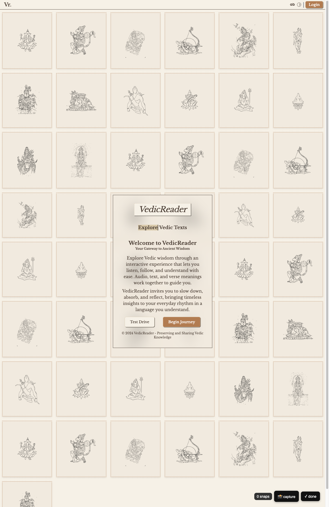
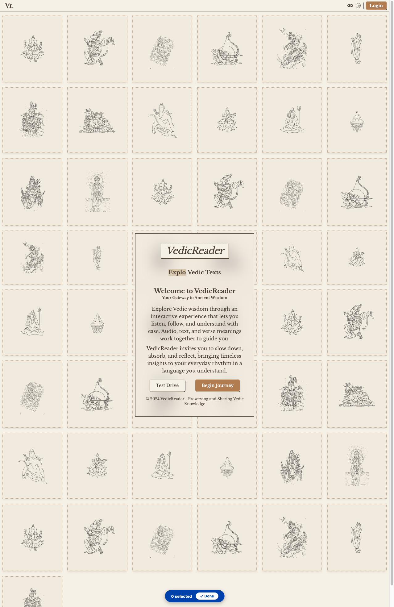

# CDP — network sniffing and replay


<!-- WARNING: THIS FILE WAS AUTOGENERATED! DO NOT EDIT! -->

The cdp module wraps Chrome’s DevTools Protocol behind a synchronous
interface.
[`cdp_connect()`](https://vedicreader.github.io/fossick/cdp.html#cdp_connect)
is the single entry point: it connects to a debug-enabled Chrome on
`port` (9223 by default), and if none is running it calls
[`cdp_setup()`](https://vedicreader.github.io/fossick/cdp.html#cdp_setup)
to start one on a persistent profile dir (`~/.cache/fastcdp/cdp-chrome`)
first. The profile persists across runs, so cookies and sessions survive
— for SSO or enterprise sites, log in once in the browser window and
every subsequent call picks up that session automatically.

Use cdp when scrapling’s stealth mode is not enough: the site checks for
enterprise SSO, reads cookies from a previous session, or ties requests
to a specific browser fingerprint.

------------------------------------------------------------------------

<a
href="https://github.com/vedicreader/fossick/blob/main/fossick/cdp.py#L51"
target="_blank" style="float:right; font-size:smaller">source</a>

### cdp_ws

``` python
def cdp_ws(
    port:int=9223, headless:bool=True, user_data_dir:NoneType=None, extra_flags:NoneType=None
)->str:
```

*Websocket debugger URL of the debug Chrome on `port`, starting one
(headless by default) if needed. For scrapling’s `cdp_url=`.*

------------------------------------------------------------------------

<a
href="https://github.com/vedicreader/fossick/blob/main/fossick/cdp.py#L44"
target="_blank" style="float:right; font-size:smaller">source</a>

### cdp_connect

``` python
async def cdp_connect(
    port:int=9223, user_data_dir:NoneType=None, headless:bool=False, extra_flags:NoneType=None
):
```

*Connect to a debug Chrome on `port`; if none is running, set one up on
a persistent profile and connect.*

------------------------------------------------------------------------

<a
href="https://github.com/vedicreader/fossick/blob/main/fossick/cdp.py#L32"
target="_blank" style="float:right; font-size:smaller">source</a>

### cdp_setup

``` python
async def cdp_setup(
    port:int=9223, user_data_dir:NoneType=None, headless:bool=False, timeout:int=15, extra_flags:NoneType=None
):
```

*Start a persistent debug Chrome on `port` with its own profile, ready
for `CDP.remote`*

------------------------------------------------------------------------

<a
href="https://github.com/vedicreader/fossick/blob/main/fossick/cdp.py#L66"
target="_blank" style="float:right; font-size:smaller">source</a>

### syncy

``` python
def syncy(
    coro, tout:int=60
):
```

*Call self as a function.*

------------------------------------------------------------------------

<a
href="https://github.com/vedicreader/fossick/blob/main/fossick/cdp.py#L70"
target="_blank" style="float:right; font-size:smaller">source</a>

### CDP.open_page

``` python
async def open_page(
    url
):
```

*Call self as a function.*

``` python
cdp = syncy(cdp_connect())
assert cdp.is_open
```

``` python
pgs = syncy(cdp.pages)
if pgs:
    tid = pgs[0]['targetId']
    sid = syncy(cdp.attach(tid))
    pg=Page(cdp, tid, sid)
    root = syncy(pg.ax_tree())
    print(str(root)[:300])
```

    - **RootWebArea** "New Tab" `focusable=True` `url=chrome://new-tab-page/` [#1]
      - **Iframe** "" [#44]
      - **combobox** "Search Google or type a URL" `live=polite` `relevant=additions text` `focusable=True` `editable=plaintext` `settable=True` `hasPopup=listbox` [#24]
      - **button** "Search by voice

``` python
page = syncy(cdp.new_page())
syncy(page.goto('https://vedicreader.com/s/'))
rt = syncy(page.ax_tree())
print(str(rt)[:300])
```

    - **RootWebArea** "VedicReader" `focusable=True` `focused=True` `url=https://vedicreader.com/` [#2]
      - **navigation** "" [#128]
        - **link** "Vr." `focusable=True` `url=https://vedicreader.com/` [#129]
          - **heading** "Vr." `level=4` [#130]
            - **StaticText** "Vr." [#262]
              - **

``` python
syncy(page.click(rt.find_id('button', 'Test Drive')))
```

## Managing the debug Chrome

`fetch(url, session=True)` and
[`cdp_ws()`](https://vedicreader.github.io/fossick/cdp.html#cdp_ws)
start the persistent debug Chrome **headless** on port 9223, and every
later
[`cdp_connect()`](https://vedicreader.github.io/fossick/cdp.html#cdp_connect)
reuses that same instance (so it stays headless). That’s fine for
scripted reads, but to log in by hand (Cloudflare / SSO / Anubis) you
need a **headed** window — and a running Chrome can’t switch modes. So:
list what’s running, quit it, and relaunch with `headless=False`. The
persistent profile keeps that logged-in session for subsequent headless
`session=True` calls.

``` python
# LIST — is a debug Chrome up, and what's open in it?
import httpx
port = 9223
print('running on 9223?', _debug_running(port))
ver = httpx.get(f'http://127.0.0.1:{port}/json/version').json()
print('browser:', ver['Browser'], '| ws:', ver['webSocketDebuggerUrl'])
for t in httpx.get(f'http://127.0.0.1:{port}/json/list').json():   # open tabs/pages
    print(' ', t['type'], '|', t['title'][:40], '|', t['url'][:50])
print('live debug ports:', [p for p in (9222, 9223, 9224) if _debug_running(p)])
```

    running on 9223? True
    browser: Chrome/150.0.7871.129 | ws: ws://127.0.0.1:9223/devtools/browser/bb4a47a3-b032-4afd-b398-83f1de66a3ab
      page | Gayathri Dhyaanam | https://vedicreader.com/
      page | New Tab | chrome://newtab/
      iframe | chrome-untrusted://new-tab-page/one-goog | chrome-untrusted://new-tab-page/one-google-bar?par
      browser_ui | Omnibox Popup | chrome://omnibox-popup.top-chrome/
      browser_ui | Omnibox Popup | chrome://omnibox-popup.top-chrome/omnibox_popup_ai
      service_worker | Service Worker chrome-extension://ilaikd | chrome-extension://ilaikdjkclophmmhodhgfmnimfeohkg
      service_worker | Service Worker chrome-extension://hbicfl | chrome-extension://hbicflpnhfmdndpibdegbnkkpngjbhf
      service_worker | Service Worker chrome-extension://epnhoe | chrome-extension://epnhoepnmfjdbjjfanpjklemanhkjgi
    live debug ports: [9223]

``` python
# CLOSE a single tab, QUIT the whole browser, then RELAUNCH it HEADED for interactive login
import httpx, time
port = 9223
tabs = httpx.get(f'http://127.0.0.1:{port}/json/list').json()
if tabs: httpx.get(f"http://127.0.0.1:{port}/json/close/{tabs[0]['id']}")   # close one tab by target id
cdp = syncy(cdp_connect(port=port))
try: syncy(cdp.quit())                        # quit browser+connection; raises ConnectionClosedOK as the socket drops
except Exception: pass
time.sleep(1.5)
assert not _debug_running(port), 'browser should be down after quit()'
syncy(cdp_setup(port, headless=False))        # relaunch HEADED so you can log in by hand
assert _debug_running(port)
print('headed Chrome ready on', port, '— log in, then reuse it via fetch(url, session=True)')
```

    headed Chrome ready on 9223 — log in, then reuse it via fetch(url, session=True)

------------------------------------------------------------------------

<a
href="https://github.com/vedicreader/fossick/blob/main/fossick/cdp.py#L77"
target="_blank" style="float:right; font-size:smaller">source</a>

### CDP.calls

``` python
async def calls(
    url:NoneType=None, pattern:str='.*', tail:int=3
):
```

*Outgoing requests matching `pattern`. Navigates if url given, else
passive.*

------------------------------------------------------------------------

<a
href="https://github.com/vedicreader/fossick/blob/main/fossick/cdp.py#L112"
target="_blank" style="float:right; font-size:smaller">source</a>

### cdp_cookies

``` python
def cdp_cookies(
    url_or_domain:NoneType=None, port:int=9223, as_dict:bool=False
):
```

*Export cookies from the running debug Chrome. Returns Playwright-format
list (for scrapling `cookies=`), or `{name: value}` if `as_dict`.*

------------------------------------------------------------------------

<a
href="https://github.com/vedicreader/fossick/blob/main/fossick/cdp.py#L144"
target="_blank" style="float:right; font-size:smaller">source</a>

### Page.md

``` python
async def md(
    sel:str=None, **kw
):
```

*Live page as clean markdown via fossick’s
[`to_md`](https://vedicreader.github.io/fossick/core.html#to_md)
(optionally narrowed to CSS `sel`)*

------------------------------------------------------------------------

<a
href="https://github.com/vedicreader/fossick/blob/main/fossick/cdp.py#L139"
target="_blank" style="float:right; font-size:smaller">source</a>

### Page.selector

``` python
async def selector():
```

*Live page as a scrapling `Selector` for CSS/xpath querying*

------------------------------------------------------------------------

<a
href="https://github.com/vedicreader/fossick/blob/main/fossick/cdp.py#L134"
target="_blank" style="float:right; font-size:smaller">source</a>

### Page.html

``` python
async def html():
```

*Live outerHTML of the page (post-JS), as a string*

------------------------------------------------------------------------

<a
href="https://github.com/vedicreader/fossick/blob/main/fossick/cdp.py#L189"
target="_blank" style="float:right; font-size:smaller">source</a>

### Page.fill_form

``` python
async def fill_form(
    page:Page, fields:dict, submit:str=None
):
```

*Fill a form by field label/name: {label: value}. Native <select> uses
its option values. Optionally click `submit` (by name) and wait. Returns
snapshot().*

------------------------------------------------------------------------

<a
href="https://github.com/vedicreader/fossick/blob/main/fossick/cdp.py#L182"
target="_blank" style="float:right; font-size:smaller">source</a>

### Page.click_settle

``` python
async def click_settle(
    page:Page, backendNodeId, timeout:int=8
):
```

*Click, then best-effort wait for the page to settle — tolerates SPA
clicks that don’t navigate (unlike `click_and_wait`).*

------------------------------------------------------------------------

<a
href="https://github.com/vedicreader/fossick/blob/main/fossick/cdp.py#L176"
target="_blank" style="float:right; font-size:smaller">source</a>

### Page.type_text

``` python
async def type_text(
    page:Page, backendNodeId, text
):
```

*Clear an input then type `text` (unlike raw `fill_text`, which
appends).*

------------------------------------------------------------------------

<a
href="https://github.com/vedicreader/fossick/blob/main/fossick/cdp.py#L168"
target="_blank" style="float:right; font-size:smaller">source</a>

### Page.snapshot

``` python
async def snapshot(
    page:Page, interactive:bool=True, keep:NoneType=None
):
```

*Compact, LLM-ready view of the page: one line per actionable element as
`[#backend_id] role "name"`. IDs feed `fill_text`/`click`.*

------------------------------------------------------------------------

<a
href="https://github.com/vedicreader/fossick/blob/main/fossick/cdp.py#L233"
target="_blank" style="float:right; font-size:smaller">source</a>

### Page.fill_sel

``` python
async def fill_sel(
    page:Page, sel:str, text:str
):
```

*Clear and type `text` into the element matching CSS `sel`.*

------------------------------------------------------------------------

<a
href="https://github.com/vedicreader/fossick/blob/main/fossick/cdp.py#L226"
target="_blank" style="float:right; font-size:smaller">source</a>

### Page.click_sel

``` python
async def click_sel(
    page:Page, sel:str, wait:bool=True
):
```

*Click the element matching CSS `sel`.*

------------------------------------------------------------------------

<a
href="https://github.com/vedicreader/fossick/blob/main/fossick/cdp.py#L217"
target="_blank" style="float:right; font-size:smaller">source</a>

### Page.node_for

``` python
async def node_for(
    page:Page, sel:str
):
```

*backendNodeId of the first element matching CSS `sel` (bridge
scrapling/CSS knowledge to CDP actions).*

------------------------------------------------------------------------

<a
href="https://github.com/vedicreader/fossick/blob/main/fossick/cdp.py#L208"
target="_blank" style="float:right; font-size:smaller">source</a>

### ax_diff

``` python
def ax_diff(
    before:str, after:str
)->str:
```

*Line diff between two `snapshot()`s (ignoring backend ids, which churn
on navigation) — what an action changed.*

------------------------------------------------------------------------

<a
href="https://github.com/vedicreader/fossick/blob/main/fossick/cdp.py#L241"
target="_blank" style="float:right; font-size:smaller">source</a>

### Page.act

``` python
async def act(
    page:Page, steps:list
):
```

*Run a declarative flow; returns {read_label_or_index: markdown} for
every (‘read’, sel) step. Re-reads the ax tree after nav.*

Steps: (‘goto’,url) (‘fill’,label,val) (‘click’,label)
(‘select’,label,val) (‘wait’,text) (‘wait_sel’,css)
(‘read’,css\[,label\]).

## Higher-level agent toolkit

`snapshot()` renders a page as compact `[#id] role "name"` lines for
LLMs, `fill_form()`/`act()` drive it declaratively,
`node_for`/`click_sel`/`fill_sel` bridge CSS→CDP, and
[`ax_diff()`](https://vedicreader.github.io/fossick/cdp.html#ax_diff)
shows what an action changed. These drive a real page in the debug
Chrome, so — like the other browser cells above — they’re `eval:false`
(run them with a debug Chrome available).

``` python
# cdp_ws(): websocket URL for scrapling's cdp_url= ; cdp_cookies(): export the browser's cookies
ws = cdp_ws()
assert ws.startswith('ws://'), ws
ck = cdp_cookies('https://httpbin.org', as_dict=True)
assert isinstance(ck, dict)
lst = cdp_cookies('https://httpbin.org')            # Playwright-format list for scrapling cookies=
assert isinstance(lst, list) and all(isinstance(c, dict) for c in lst)
print('ws ok |', len(ck), 'cookies')
```

    ws ok | 0 cookies

``` python
# Live in the debug Chrome: snapshot() -> CSS->CDP bridge -> ax_diff() across a navigation
cdp = syncy(cdp_connect())
pg  = syncy(cdp.open_page('https://httpbin.org/forms/post'))
snap = syncy(pg.snapshot())
assert snap.startswith('#') and '[#' in snap and 'textbox' in snap.lower()   # [#id] role "name" lines
bid = syncy(pg.node_for('input[name=custname]'))                             # CSS selector -> backendNodeId
assert isinstance(bid, int)
syncy(pg.fill_sel('input[name=custname]', 'Ada Lovelace'))                   # clear + type via selector
# ax_diff() surfaces STRUCTURAL change: navigate to a different page and diff the two snapshots
syncy(pg.act([('goto', 'https://example.com')]))
diff = ax_diff(snap, syncy(pg.snapshot()))
assert diff != '(no change)'                                                 # different page -> non-empty diff
print(diff[:200])
```

    -# 
    -https://httpbin.org/forms/post
    +# Example Domain
    +https://example.com/
    -textbox "Customer name: "
    -textbox "Telephone: "
    -textbox "E-mail address: "
    -radio " Small"
    -radio " Medium"
    -radio " Larg

``` python
# fill_form()/act(): fill a real form by label, then read back the echoed values
cdp = syncy(cdp_connect())
fp  = syncy(cdp.open_page('https://httpbin.org/forms/post'))
snap = syncy(fp.fill_form({'Customer name': 'Ada Lovelace'}))   # fill by label -> returns a snapshot()
assert '[#' in snap
```

``` python
# declarative equivalent: navigate, fill, and read a region back as markdown
reads = syncy(fp.act([('goto', 'https://httpbin.org/forms/post'),
                      ('fill', 'Customer name', 'Ada Lovelace'),
                      ('read', 'form', 'form')]))
assert 'form' in reads and isinstance(reads['form'], str)
print(list(reads))
```

    ['form']

``` python
apis = syncy(cdp.calls('https://www.woolworths.com.au/shop/search/products?searchTerm=Apples%20%26%20Pears', pattern='.apis/ui/Search/products'))
```

------------------------------------------------------------------------

<a
href="https://github.com/vedicreader/fossick/blob/main/fossick/cdp.py#L296"
target="_blank" style="float:right; font-size:smaller">source</a>

### Page.collect

``` python
async def collect(
    page:Page, save_dir:NoneType=None, prefix:NoneType=None, stop:NoneType=None, tout:NoneType=None,
    count:NoneType=None, every_n:NoneType=None
):
```

*Call self as a function.*

``` python
page = syncy(cdp.new_page())
syncy(page.goto('https://vedicreader.com/s/'))
imgs = syncy(page.collect(count=1, tout=5, every_n=1))
if imgs: imgs[0].width, imgs[0].height = 200, 400
imgs[0]
```

    📸 capture, ✓ done (or stop.set()) to finish. → None/



------------------------------------------------------------------------

<a
href="https://github.com/vedicreader/fossick/blob/main/fossick/cdp.py#L422"
target="_blank" style="float:right; font-size:smaller">source</a>

### Page.annotate

``` python
async def annotate(
    page:Page, save_dir:NoneType=None, prefix:NoneType=None, stop:NoneType=None, tout:NoneType=None
):
```

*Click elements interactively; returns (screenshot, \[{n, role, name,
selector}\]) with badges baked in.*

``` python
img, elements = syncy(page.annotate(save_dir='shots', tout=2))
img.height, img.width = 400, 200
img
```

    Click elements to annotate, ✓ Done when ready.
    saved VedicReader.png


